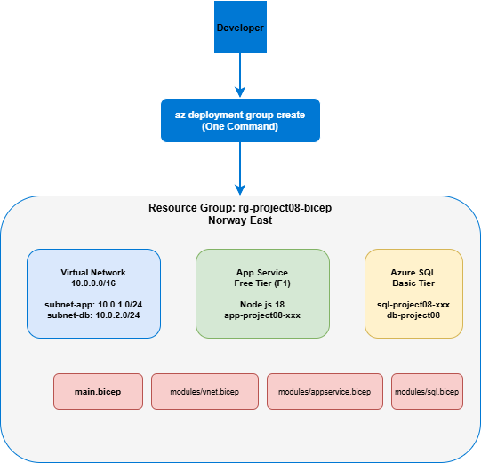

# Infrastructure as Code with Azure Bicep



---

## Overview

Most engineers build cloud infrastructure by clicking through the Azure portal. This project does it differently.

Every resource — the Virtual Network, the subnets, the App Service Plan, and the Web App — is defined as code in `.bicep` files and deployed with a single terminal command. Delete the entire environment and run the same command again. You get the exact same infrastructure back in under 5 minutes.

That is Infrastructure as Code.

---

## What Was Built

A modular Azure architecture deployed entirely through Bicep:

- **Virtual Network** with two subnets — one for application tier, one for database tier
- **App Service Plan** — Free tier hosting plan
- **Web Application** — Live Azure App Service with a public URL

---

## Tech Stack

| Layer | Technology |
|---|---|
| IaC Tool | Azure Bicep |
| Networking | Azure Virtual Network (10.0.0.0/16) |
| Compute | Azure App Service — Free Tier (F1) |
| CLI | Azure CLI 2.86 |
| Source Control | GitHub |
| Region | Norway East |

---

## What Bicep Does in This Project

| Concept | What it does |
|---|---|
| **param** | Accepts variables at deploy time — location, app name, credentials |
| **resource** | Declares one Azure resource to create |
| **module** | Calls a separate .bicep file — keeps each resource isolated and reusable |
| **uniqueString()** | Generates a unique suffix so resource names never conflict across deployments |
| **output** | Prints important values after deployment — App URL, VNet name — without manual searching |
| **@secure()** | Marks sensitive parameters so they are never logged or exposed |

---

## Project Structure---

## How to Deploy

```bash
az group create --name rg-bicep-3tier --location norwayeast

az deployment group create \
  --resource-group rg-bicep-3tier \
  --template-file main.bicep \
  --parameters parameters.json

az deployment group show \
  --resource-group rg-bicep-3tier \
  --name main \
  --query properties.outputs

az group delete --name rg-bicep-3tier --yes --no-wait
```

---

## Deployment Output

```json
{
  "appUrl": "https://app-p08-rkgzkmw4e3sqi.azurewebsites.net",
  "vnetName": "vnet-project08"
}
```

---

## Key Learnings

- **Modularity matters** — splitting each resource into its own .bicep file makes the code readable, testable, and reusable
- **Repeatability is the point** — IaC removes the risk of environment drift; every deployment is identical
- **Outputs replace manual discovery** — Bicep prints exactly what you need after deployment
- **Version control for infrastructure** — every change is tracked in Git with full history
- **uniqueString() is essential** — Azure resource names must be globally unique; this solves it automatically
